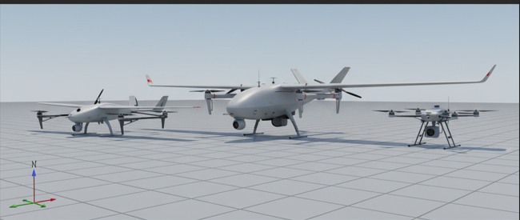
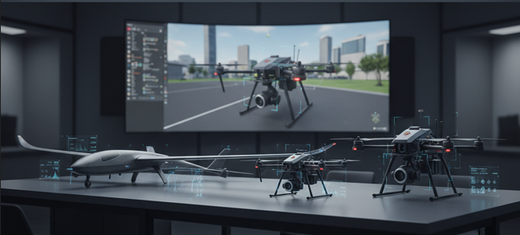

# Hi, I'm Mehmet Yusuf Ocak! 👋

<!-- Profil üst kısmında öne çıkan cihaz/proje görselleri -->

  
  

---

## 🚀 About Me

- 💻 Software Engineer & UAV Systems Enthusiast
- 🎮 Robotics, Simulation, and Automation Lover
- 🎓 Computer Engineering student at Sivas Science and Technology University
- 🌍 Based in Şanlıurfa & Sivas, Turkey

## 🏆 Achievements & Projects

- **2025 Teknofest Air Defense Systems Competition**  
  Finalist (6th place among 515 teams)  
  [See on Linkedin Post](https://www.linkedin.com/posts/mehmetyusufocak63_t3vakfaft-aselsan-milliteknolojihamlesi-activity-7376912497209016320-_inW?utm_source=social_share_send&utm_medium=member_desktop_web&rcm=ACoAAEileeoBHpSParqkFHWkbeOdqL487oHL_ug)

- **UAV Simulation & Control**  
  Developed and tested UAV control algorithms in Gazebo and ROS environments.

## 🛠️ Skills & Technologies

- **Programming Languages:** C++, Python, Java, Kotlin, JavaScript, TypeScript
- **Frameworks/Libraries:** ROS, OpenCV, React, Next.js, Node.js
- **Tools:** Gazebo Simulation, Docker, Git, CI/CD
- **Other:** Image Processing, UAV Control, Cyber Security, Manual Testing

## 🎓 Education & Experience

- **Sivas Science and Technology University**  
  Computer Engineering (2022 - ongoing)

- **Internships:**  
  - ArkSigner Software & Hardware Industry Inc. – Software Engineering Intern  
  - UAV Control & Simulation Lab – Research Intern

## 🌐 Languages

- English: B2 (Upper Intermediate)
- German: A2 (Elementary)

## 📬 Contact Me

---

> I am always seeking to learn, improve, and contribute to innovative projects in robotics and defense technologies. Let’s connect and collaborate!
